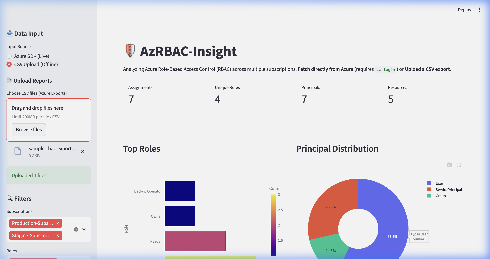

# 🛡️ Azure RBAC Insight

**Azure RBAC Insight** is a Streamlit-powered security dashboard designed for deep-dive analysis and visualization of Azure Role-Based Access Control (RBAC) assignments across multiple subscriptions.

---

## 💡 Why this project?

> "I was tasked with reviewing RBAC across all our subscriptions. Navigating the Azure Portal to check permissions on every individual resource was tedious and fragmented. I needed a way to see the 'big picture'—to filter by identity, spot over-privileged accounts, and identify resource hotspots in seconds. So, I built this tool."

---

## ✨ Key Features

*   **Multi-Subscription Fetch**: Aggregate role assignments from all your Azure subscriptions in one click.
*   **Dual-Mode Ingestion**: 
    *   **Live**: Fetch data directly via Azure SDK (requires `az login`).
    *   **Offline**: Upload CSV exports from the Azure Portal for air-gapped analysis.
*   **Visual Analytics**: Interactive Plotly charts for Role Distribution and Principal Types.
*   **Granular Filtering**: Slice by Subscription, Role Name, and Resource Scope.
*   **Zero-Footprint**: Runs entirely on your local machine or in a lightweight container.

---

## 🏗️ Quick Start (Local Run)

### 1. Requirements
*   **Python**: 3.12+
*   **Azure Permissions**: You must have at least **Reader** access to the subscription(s) you wish to audit.
*   **Identity Mapping**: When using **Live Fetch**, the tool displays **Principal IDs**. For human-readable **Display Names**, please use the **CSV Upload** mode.

### 2. Setup
1.  **Clone**: `git clone https://github.com/chinmaymjog/azure-rbac-insight.git`
2.  **Install**: `pip install -r requirements.txt`
3.  **Auth**: Ensure you are logged in via Azure CLI: `az login`
4.  **Run**: `streamlit run app.py`

### 3. Docker Compose
1.  **Run**: `docker-compose up --build`
2.  **Access**: Open `http://localhost:8501`

---

## 📖 Documentation
For detailed instructions on how to export CSV data from Azure, check the:
- 👉 **[Comprehensive User Guide](./HOW_TO_GUIDE.md)**

## 🤝 Contributing
Contributions are welcome! Please see the **[Contribution Guidelines](./CONTRIBUTING.md)** for details.

## 🛡️ Security
This tool uses **DefaultAzureCredential**. It inherits the permissions of your logged-in session. It only requires **Reader** access to the subscription(s). No data is sent to external servers.

---
*Maintained by [Chinmay Jog](https://github.com/chinmaymjog)*